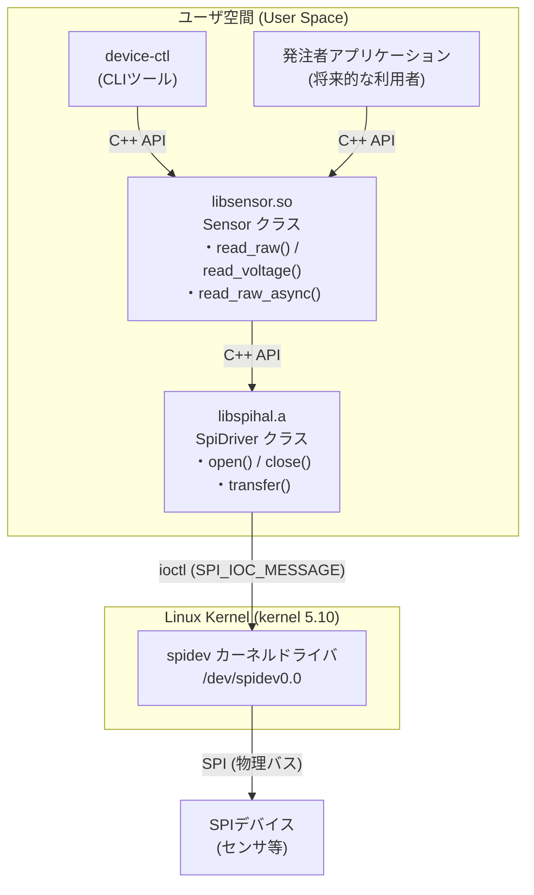

# 基本設計書 — システム構成

| 項目 | 内容 |
|---|---|
| ドキュメント番号 | DES-001 |
| バージョン | 1.1 |
| 作成日 | 2025-02-14 |
| 作成者 | 山田 太郎 |

---

## 1. システム全体構成



> 図の Draw.io 版: [system-architecture.drawio](system-architecture.drawio)

## 2. コンポーネント間依存関係

```mermaid
graph TD
    CLI[device-ctl] --> LIB[libsensor.so]
    LIB --> DRV[libspihal.a]
    DRV --> SPIDEV[/dev/spidev0.0]
    APP[発注者App] --> LIB
```

## 3. ビルド成果物

| 成果物 | 種別 | 提供先 |
|---|---|---|
| `libspihal.a` | 静的ライブラリ | libsensor内部リンク |
| `libsensor.so.1.1.0` | 動的共有ライブラリ | 発注者アプリ・CLI |
| `device-ctl` | 実行ファイル | 動作確認・デバッグ用 |

## 4. 実行環境

| 項目 | 仕様 |
|---|---|
| ハードウェア | Raspberry Pi 3B+ |
| OS | Linux kernel 5.10.x |
| コンパイラ | GCC 13 / Ubuntu 24.04（C++17） |
| SPIデバイス | /dev/spidev0.0（最大 2MHz） |
