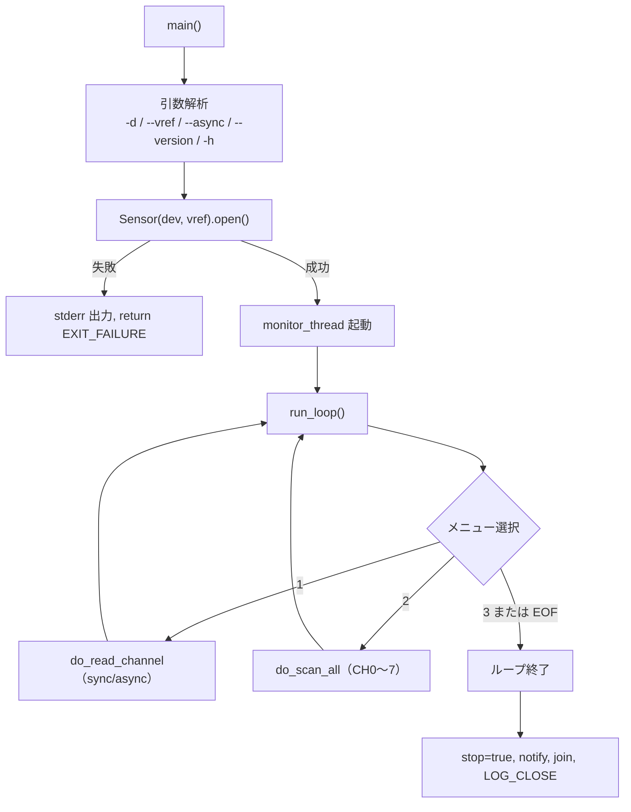

# 詳細設計書 — device-ctl

| 項目 | 内容 |
|---|---|
| ドキュメント番号 | DES-CLI-001 |
| バージョン | 1.0 |
| 作成日 | 2026-06-01 |
| 作成者 | 開発チーム |

---

## 1. 概要

`device-ctl` は `libsensor`（`Sensor`）にリンクする実行ファイル。引数解析 → `Sensor` オープン → バックグラウンドモニタ起動 → 対話ループ、という流れで動く。利用者向けの操作仕様は [OPS-CLI-001](../04_api-spec/cli-device-ctl-spec.md)。

## 2. 全体フロー



## 3. 引数解析

`argv[argi][0] == '-'` の間ループして解釈する。

| 引数 | 処理 |
|---|---|
| `-d <device>` | `dev_path` を設定 |
| `--vref <V>` | `std::stod`。数値でなければ `EXIT_FAILURE` |
| `--async` | `async_mode = true` |
| `--version` / `-h` | 表示して `EXIT_SUCCESS` |
| 未知の `-...` | `EXIT_FAILURE` |

ループ後に残余引数があれば「予期しない引数」で `EXIT_FAILURE`。

## 4. 対話ループ（run_loop）

```
while true:
  flush_monitor()        // 保留中のモニタ結果を表示
  print_menu()
  prompt_line("選択: ")   // getline が false（EOF）なら break
  "1" → do_read_channel(sensor, async_mode)
  "2" → do_scan_all(sensor)
  "3" → break
  その他 → 「無効な選択です」
```

## 5. 非同期読み出し（do_read_channel, --async）

`read_raw_async()` はワーカースレッドを `Sensor` 側で保持し（デタッチしない）デストラクタで `join` するが、CLI 側もコールバック完了を早期に検知できるよう `mutex` + `condition_variable` で完了を待ち合わせる。

- 共有データ（`result` / `cb_err` / `done`）は `mtx` で保護。
- コールバックは**ロック内で `notify_one`** する（デタッチワーカーと `cv` 破棄の競合回避）。
- 呼び出し側は `cv.wait(lk, []{ return done; })` で完了まで待つ（`Sensor` のライフタイムを保証）。

## 6. バックグラウンドモニタ（monitor_thread_fn）

`MonitorState` は `mutex` / `condition_variable` / `atomic<bool> stop` / `last_raw` / `pending` を持つ。

```
while !stop:
  cv.wait_for(1 分, predicate = stop)   // 停止要求が来たら即起床
  if stop: break
  last_raw = sensor.read_raw(0); pending = true
```

メインスレッドは次のメニュー描画前に `flush_monitor()` で `pending` を表示する（モニタ出力と対話入出力が混ざらないようにするため）。

> `Sensor` 自体はスレッドセーフではないが、本 CLI ではモニタスレッドと対話スレッドが**同時に `read_raw` を呼ばない**運用（モニタは 1 分間隔・対話は人間の入力起点）を前提にしている。

## 7. 終了処理

`run_loop` を抜けたら `stop.store(true)` → `cv.notify_all()` → `monitor_thread.join()`。最後に `LOG_CLOSE()` してから `EXIT_SUCCESS`。

## 8. バージョン履歴

| バージョン | 変更内容 |
|---|---|
| 1.0 | 初版 |
