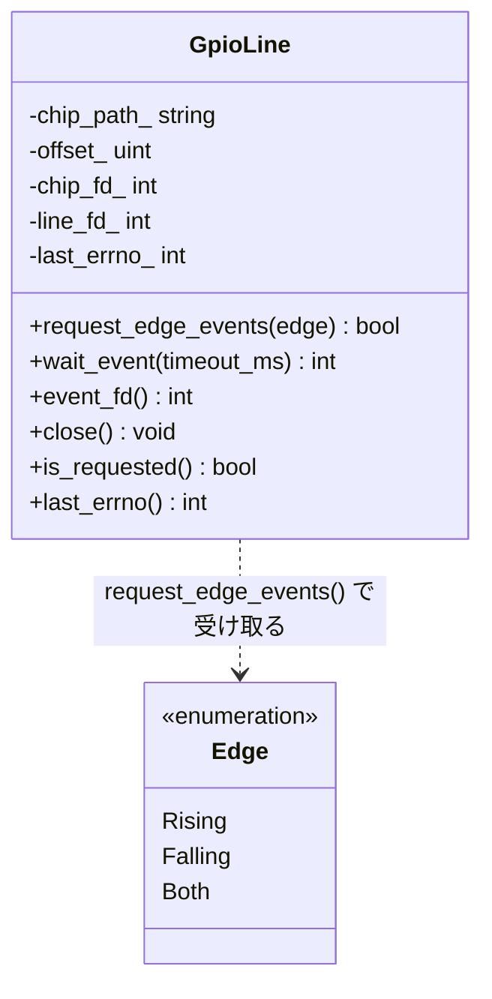
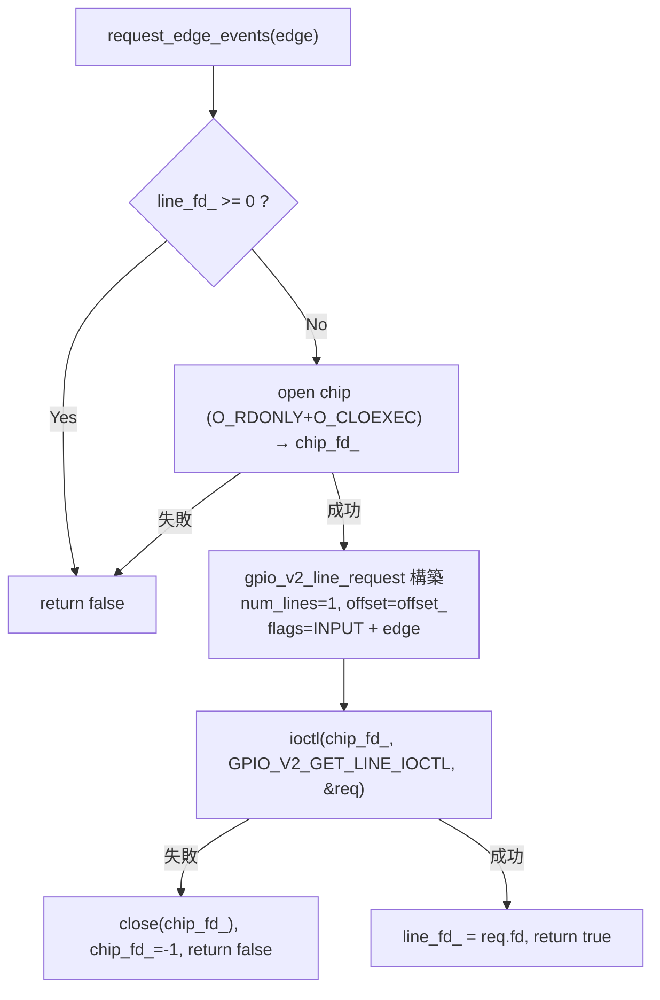

# 詳細設計書 — GpioLine

| 項目 | 内容 |
|---|---|
| ドキュメント番号 | DES-GPIO-001 |
| バージョン | 1.0 |
| 作成日 | 2026-06-01 |
| 作成者 | 開発チーム |

---

## 1. クラス概要

`GpioLine` は GPIO 1 ラインのエッジ割り込みを扱う。GPIO チップ fd（`chip_fd_`）とライン fd（`line_fd_`）の 2 つを保持し、デストラクタで自動 close する（RAII）。SPI/I2C のポーリングと異なり、`epoll` で「イベントが来るまで眠る」イベント駆動モデルを実装する。

## 2. クラス図



## 3. メソッド詳細

### 3.1 request_edge_events()



`edge` から検出フラグへの変換:

| `Edge` | フラグ |
|---|---|
| `Rising` | `GPIO_V2_LINE_FLAG_EDGE_RISING` |
| `Falling` | `GPIO_V2_LINE_FLAG_EDGE_FALLING` |
| `Both` | `EDGE_RISING \| EDGE_FALLING` |

### 3.2 wait_event()

```
ガード: line_fd_ < 0 → EBADF, return -1
処理:
  1. epfd = epoll_create1(EPOLL_CLOEXEC)
  2. epoll_ctl(EPOLL_CTL_ADD, line_fd_, EPOLLIN)
  3. n = epoll_wait(epfd, &out, 1, timeout_ms)
  4. close(epfd)
  5. n < 0 → -1 / n == 0 → 0（タイムアウト）
  6. n > 0 → read(line_fd_, &gpio_v2_line_event) でイベントを取り出し return 1
```

> 設計上の注意: `wait_event()` は呼び出しごとに epoll インスタンスを生成・破棄する（1 ラインのシンプル用途のため）。複数 fd を 1 ループで捌く場合は `event_fd()` で得たライン fd を外部の epoll に組み込む。

### 3.3 close()

ライン fd → チップ fd の順に閉じ、それぞれ `-1` に戻す。二重 close は安全（no-op）。

## 4. エラーハンドリング方針

- 失敗時は `last_errno_` に `errno` を保存（`request_edge_events` 前の `wait_event` は `EBADF`）。
- 例外は使用しない。失敗は戻り値で表す。

## 5. スレッド安全性

スレッドセーフではない。コピー禁止。

## 6. バージョン履歴

| バージョン | 変更内容 |
|---|---|
| 1.0 | 初版 |
