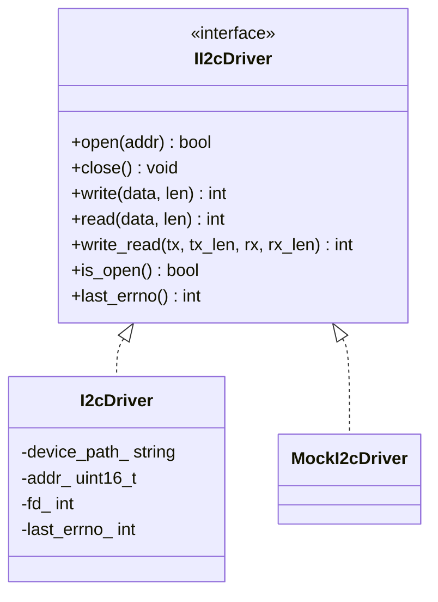
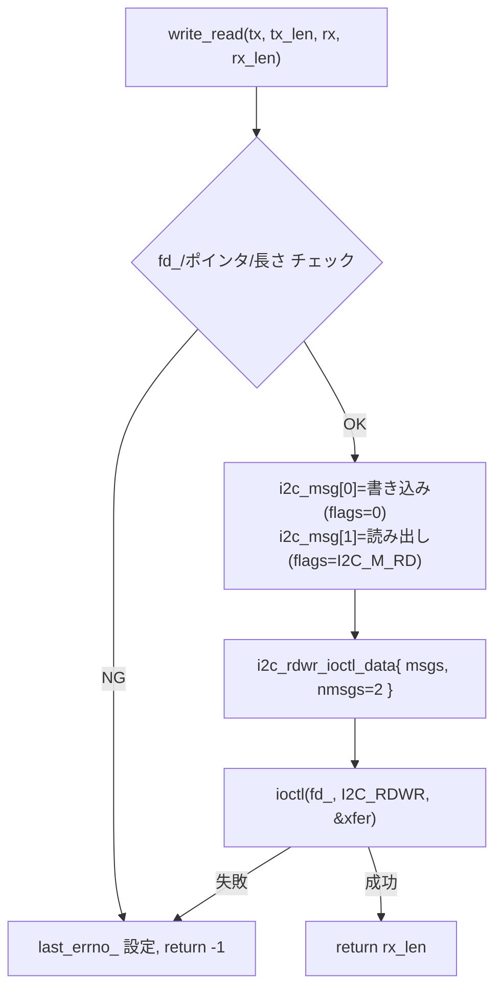

# 詳細設計書 — I2cDriver

| 項目 | 内容 |
|---|---|
| ドキュメント番号 | DES-I2C-001 |
| バージョン | 1.0 |
| 作成日 | 2026-06-01 |
| 作成者 | 開発チーム |

---

## 1. クラス概要

`I2cDriver` は `/dev/i2c-N`（Linux i2c-dev）を介して I2C スレーブとハーフデュプレクス通信を行う。ファイルディスクリプタのライフタイムをクラスで管理し、コピー禁止とする。`II2cDriver` を実装し、上位（`Ads1115`）は抽象に依存する（DI）。構造は `spi-hal` の `SpiDriver` と意図的に揃えてある。

## 2. クラス図



## 3. メソッド詳細

### 3.1 open()

```
入力: addr（7bit スレーブアドレス）
処理:
  1. fd_ >= 0 なら二重オープンとして false
  2. ::open(device_path_, O_RDWR) → fd_
  3. ioctl(fd_, I2C_SLAVE, addr) でスレーブを設定
     失敗時は ::close(fd_) して fd_ = -1, false
  4. addr_ = addr, true
出力: bool
```

### 3.2 write() / read()

```
ガード: fd_ < 0 → EBADF / data == nullptr → EINVAL / len == 0 → 0 を返す
本体:  ::write(fd_, data, len) または ::read(fd_, data, len)
       戻り < 0 なら last_errno_ = errno, -1
       それ以外は転送バイト数
```

### 3.3 write_read() — リピーテッドスタート



`I2C_RDWR` に 2 つの `i2c_msg`（書き込み→読み出し）を渡すことで、間に **STOP を挟まずリピーテッドスタート**で接続する。レジスタを持つデバイスの読み出しで他マスタの割り込みを避けるための定石。

## 4. エラーハンドリング方針

- エラー発生時は `last_errno_` に `errno` を保存する。
- 例外は使用しない（組み込み環境を考慮）。失敗は戻り値で表す。
- 入力検証: `EBADF`（未オープン）/ `EINVAL`（NULL・長さ0）/ `EOVERFLOW`（`len > UINT16_MAX`）。

## 5. スレッド安全性

`I2cDriver` はスレッドセーフではない。複数スレッドから同一インスタンスを使う場合は呼び出し側でロックする。

## 6. 依存関係 / 注入点（DI）

- 上位の `Ads1115` は `II2cDriver*` を受け取る（コンストラクタ注入）。テストでは `MockI2cDriver` を注入し、実機 I2C なしで `write_read` 呼び出しシーケンスを検証する。
- ログは `common/include/logger.hpp` の `LOGI/LOGW/LOGE/LOGD` を使用。

## 7. バージョン履歴

| バージョン | 変更内容 |
|---|---|
| 1.0 | 初版 |
