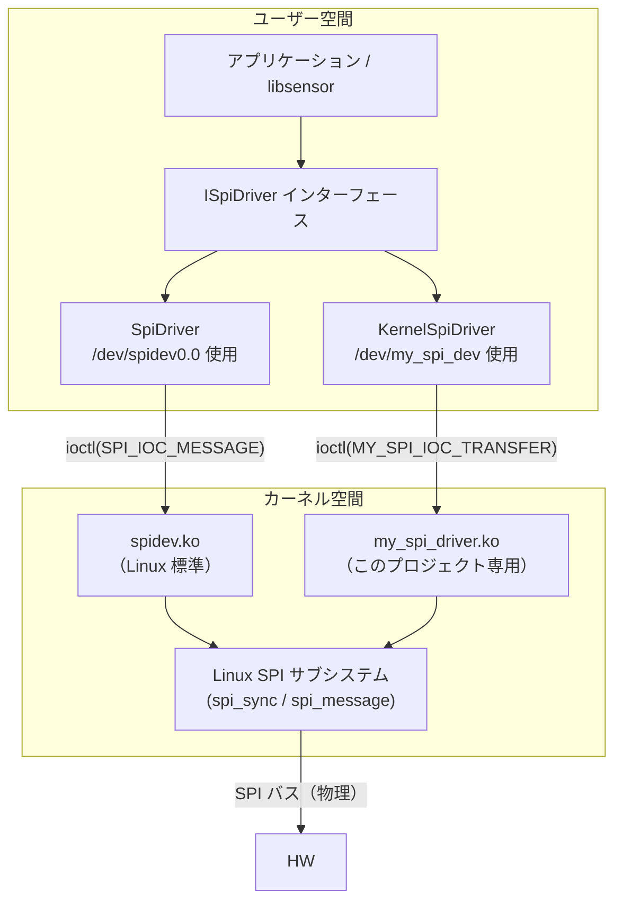
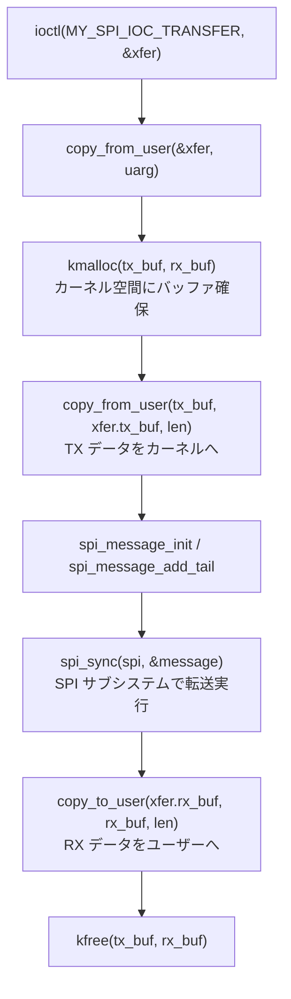
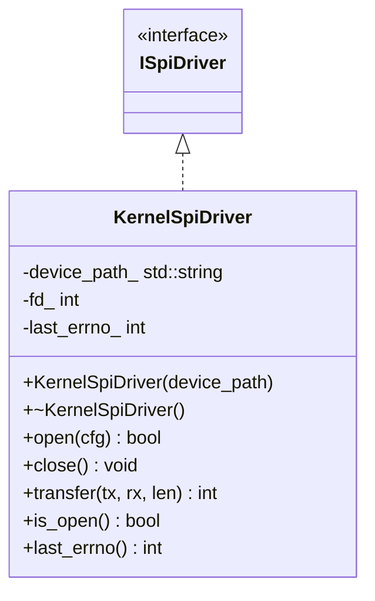

# 詳細設計書 — KernelSpiDriver / my_spi_driver カーネルモジュール

| 項目 | 内容 |
|---|---|
| ドキュメント番号 | DES-DRV-002 |
| バージョン | 1.0 |
| 作成日 | 2026-05-21 |
| 関連ドキュメント | DES-DRV-001（SpiDriver 設計書） |

---

## 1. 概要と目的

このドキュメントは、Linux カーネル SPI デバイスドライバ（`my_spi_driver.ko`）と、それに対応するユーザー空間ドライバクラス（`KernelSpiDriver`）の設計を説明する。

### 1.1 SpiDriver との違い

| 項目 | SpiDriver | KernelSpiDriver |
|---|---|---|
| カーネルドライバ | `spidev`（汎用、Linux 標準） | `my_spi_driver`（専用） |
| デバイスノード | `/dev/spidev0.0` | `/dev/my_spi_dev` |
| 設定 ioctl | `SPI_IOC_WR_MODE` 等（spidev 標準） | `MY_SPI_IOC_CONFIG`（独自） |
| 転送 ioctl | `SPI_IOC_MESSAGE(1)`（spidev 標準） | `MY_SPI_IOC_TRANSFER`（独自） |
| カーネル側処理 | `spi_write_then_read` 等 | `spi_sync`（`spi_message` で制御） |
| 用途 | 汎用プロトタイピング | プロジェクト専用拡張・機能追加 |

### 1.2 なぜ専用カーネルドライバが必要か

`spidev` は汎用ドライバであり、プロジェクト固有の機能（例：特定 IC の初期化シーケンス、割り込み処理、DMA 対応）を組み込めない。専用カーネルモジュールにより：

- プロジェクト固有の処理をカーネル空間で実装できる
- 独自の ioctl インターフェースで拡張しやすい
- Device Tree でデバイスを記述し、自動バインドが可能

---

## 2. システム構成図



---

## 3. カーネルモジュール設計

### 3.1 ファイル構成

```
kernel/
├── Makefile           # カーネルビルドシステム用 Makefile
├── my_spi_driver.c    # モジュール本体
└── include/
    └── my_spi_dev.h   # カーネル・ユーザー空間共有 ioctl 定義
                       # （spi-hal/CMakeLists.txt の include path 経由でユーザ空間からも参照）
```

### 3.2 モジュール主要コンポーネント

```
my_spi_driver.c
├── struct my_spi_priv         プライベートデータ（デバイスごと）
│     ├── struct spi_device*   SPI デバイス（カーネルが管理）
│     ├── struct miscdevice    キャラクタデバイス登録用
│     ├── struct mutex         排他制御
│     └── struct my_spi_config 現在の設定
│
├── file_operations
│     ├── my_spi_open()        open(2) ハンドラ
│     ├── my_spi_release()     close(2) ハンドラ
│     └── my_spi_ioctl()       ioctl(2) ハンドラ
│           ├── MY_SPI_IOC_CONFIG   → spi_setup()
│           └── MY_SPI_IOC_TRANSFER → spi_sync()
│
└── spi_driver
      ├── my_spi_probe()       デバイス検出時に呼ばれる
      └── my_spi_remove()      デバイス削除時に呼ばれる
```

### 3.3 ioctl コマンド定義

| コマンド | 方向 | 引数型 | 説明 |
|---|---|---|---|
| `MY_SPI_IOC_CONFIG` | write-only | `struct my_spi_config` | speed/mode/bits を設定し `spi_setup()` を呼ぶ |
| `MY_SPI_IOC_TRANSFER` | read/write | `struct my_spi_transfer` | フルデュプレクス転送（`spi_sync()`） |

```c
struct my_spi_config {
    uint32_t speed_hz;      // クロック周波数 [Hz]
    uint8_t  bits_per_word; // ワードビット幅（通常 8）
    uint8_t  mode;          // SPI モード 0〜3
};

struct my_spi_transfer {
    uint64_t tx_buf;  // ユーザー空間 TX バッファのアドレス
    uint64_t rx_buf;  // ユーザー空間 RX バッファのアドレス
    uint32_t len;     // 転送バイト数（最大 4096）
};
```

### 3.4 MY_SPI_IOC_TRANSFER の処理フロー



---

## 4. KernelSpiDriver クラス設計

### 4.1 クラス図



### 4.2 open() の処理

```
入力: Config（speed_hz, bits_per_word, mode）
処理:
  1. ::open(device_path_, O_RDWR) → fd_
  2. my_spi_config 構造体を構築
  3. ioctl(fd_, MY_SPI_IOC_CONFIG, &kcfg)
  いずれかが失敗した場合 fd_ をクローズして false を返す
出力: bool（成功/失敗）
```

### 4.3 transfer() の処理

```
入力: tx バッファ, rx バッファ, len バイト数
処理:
  1. fd_ < 0 → -1 返却（未オープンガード、EBADF）
  2. tx/rx が nullptr → -1 返却（ヌルポインタガード、EINVAL）
  3. len が uint32_t を超過 → -1 返却（オーバーフローガード、EOVERFLOW）
  4. len == 0 → 0 返却（no-op）
  5. my_spi_transfer 構造体を構築（ポインタを uint64_t にキャスト）
  6. ioctl(fd_, MY_SPI_IOC_TRANSFER, &xfer)
  失敗時: -1 返却、last_errno_ に errno を保存
  成功時: len を返却
出力: 転送バイト数 or -1
```

引数検証（1〜3）は `SpiDriver::transfer()` と共通の実装（`spi_transfer_validate.hpp` の
`validate_spi_transfer()`）を使う（[SpiDriver API 仕様書](../04_api-spec/spi-driver-api.md) §2A、
テストケース `UT-KDRV-011`）。

---

## 5. ビルド方法

### 5.1 カーネルモジュールのビルド

カーネルヘッダが必要（Raspberry Pi の場合 `sudo apt install raspberrypi-kernel-headers`）。

```bash
cd kernel/
make                              # 現在のカーネル向け
make KDIR=/path/to/kernel-src     # クロスコンパイル向け
```

成果物: `kernel/my_spi_driver.ko`

### 5.2 ユーザー空間ライブラリのビルド

```bash
cmake -S . -B build
cmake --build build
```

`libspihal.a` に `KernelSpiDriver` が含まれる。

### 5.3 カーネルモジュールのロード

```bash
sudo insmod kernel/my_spi_driver.ko
ls -l /dev/my_spi_dev            # デバイスノードの確認
dmesg | tail                     # probe ログの確認
```

### 5.4 カーネルモジュールの自動ロード（永続化）

```bash
sudo make -C kernel install       # /lib/modules/$(uname -r)/ にインストール
echo "my_spi_driver" | sudo tee /etc/modules-load.d/my-spi.conf
```

---

## 6. Device Tree オーバーレイ（Raspberry Pi 例）

カーネルモジュールが SPI バスにバインドするためにはデバイスツリーへの登録が必要。

```dts
/dts-v1/;
/plugin/;

/ {
    compatible = "brcm,bcm2835";

    fragment@0 {
        target = <&spi0>;
        __overlay__ {
            #address-cells = <1>;
            #size-cells = <0>;

            my_spi_dev: my-spi-dev@0 {
                compatible = "my,spi-dev";
                reg = <0>;                      /* CS0 */
                spi-max-frequency = <1000000>;  /* 1 MHz */
                status = "okay";
            };
        };
    };
};
```

適用方法:
```bash
dtc -I dts -O dtb -o my-spi.dtbo my-spi.dts
sudo cp my-spi.dtbo /boot/overlays/
echo "dtoverlay=my-spi" | sudo tee -a /boot/config.txt
sudo reboot
```

---

## 7. 使用例

```cpp
#include "kernel_spi_driver.hpp"

// カーネルモジュールロード済みの前提
embedded::KernelSpiDriver drv("/dev/my_spi_dev");
embedded::ISpiDriver::Config cfg{1000000, 8, 0};

if (!drv.open(cfg)) {
    fprintf(stderr, "open failed: errno=%d\n", drv.last_errno());
    return 1;
}

uint8_t tx[] = {0x80, 0x00};
uint8_t rx[2] = {};
int n = drv.transfer(tx, rx, sizeof(tx));
if (n < 0) {
    fprintf(stderr, "transfer failed: errno=%d\n", drv.last_errno());
}
```

`Sensor` クラスへの注入（`ISpiDriver*` を受け取るコンストラクタを使用）:

```cpp
embedded::KernelSpiDriver kernel_drv("/dev/my_spi_dev");
embedded::Sensor dev(&kernel_drv);  // ISpiDriver* を注入
```

---

## 8. エラーハンドリング

`SpiDriver` と同じ方針に従う（`spihal-design.md` セクション 4 参照）。

- エラー発生時は `last_errno_` に `errno` を保存
- 例外を使用しない（`noexcept`）
- 戻り値で成否を判断し、必要に応じて `last_errno()` を参照

---

## 9. スレッド安全性

`KernelSpiDriver` はスレッドセーフではない（`SpiDriver` と同様）。カーネル側の `my_spi_priv.lock`（mutex）により複数プロセスからの同時アクセスは保護されるが、単一プロセス内での複数スレッドからの同一インスタンス共有は呼び出し側で排他制御を行うこと。
