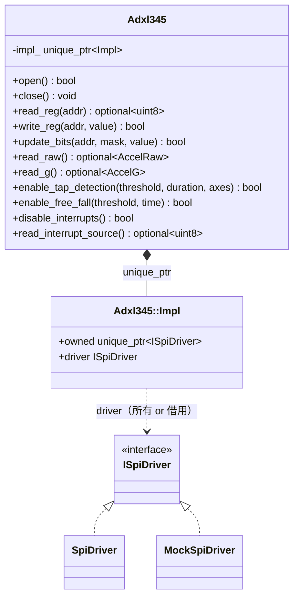

# 詳細設計書 — Adxl345

| 項目 | 内容 |
|---|---|
| ドキュメント番号 | DES-ADXL-001 |
| バージョン | 1.0 |
| 作成日 | 2026-06-01 |
| 作成者 | 開発チーム |

---

## 1. クラス概要

`Adxl345` は ADXL345（3軸 SPI 加速度センサ）への高レベルアクセスを提供する。`SpiDriver` を **PIMPL**（`struct Impl;` 前方宣言 + `unique_ptr`）で隠蔽し、`ISpiDriver` への依存注入（DI）で実機/モックを切り替える。レジスタアクセス層（`read_reg`/`write_reg`/`update_bits`）の上に加速度読み出し API を構築する。

> **位置づけ（重要）**: `libadxl345` は `libsensor`（`Sensor`=MCP3008 / `Ads1115`=ADS1115）とは**独立した別コンポーネント**である。ディレクトリ・CMake ターゲット・リリースタグ（`libadxl345/v*`）をそれぞれ独立して持ち、`libsensor` を取り除いても単体でビルド・動作する。`spi-hal`（`ISpiDriver`）だけを共有する。
> - `libsensor` … **コマンド型 ADC**（レジスタを持たず、決まったバイト列を送って読む）の例。
> - `libadxl345` … **レジスタ型デバイス**（レジスタマップをビット単位で読み書きする）の例。
> 対になる2つの設計例として読み比べると、デバイス種別ごとの抽象化の違いが分かりやすい。

## 2. クラス図



## 3. メソッド詳細

### 3.1 open() 初期化シーケンス

```
1. ISpiDriver::Config{ speed_hz=1MHz, bits_per_word=8, mode=3 } で open
2. read_device_id() → DEVID(0x00) が 0xE5 でなければ close して false
3. write_reg(DATA_FORMAT, FULL_RES | RANGE_16G)  失敗なら close して false
4. write_reg(POWER_CTL, MEASURE)                 失敗なら close して false（測定開始）
return true
```

### 3.2 read_reg() / write_reg() — アドレスバイトのフレーミング

各転送は 2 バイト。先頭の**アドレスバイト**で R/W・連続転送・アドレスを指定する（`adxl345::access`）。

| 操作 | TX | RX |
|---|---|---|
| `read_reg(addr)` | `[ READ\|addr, 0x00 ]` | `[ _, value ]` |
| `write_reg(addr, value)` | `[ WRITE\|addr, value ]` | `[ _, _ ]` |

- `READ=0x80`（bit7=1）/ `WRITE=0x00` / `MULTIBYTE=0x40`（bit6）/ `ADDR_MASK=0x3F`（bit5:0）。

### 3.3 read_raw() — マルチバイト読み出し

```
TX: [ READ | MULTIBYTE | DATAX0(0x32),  dummy x6 ]   （アドレスバイト = 0xF2）
RX: [ _, X0, X1, Y0, Y1, Z0, Z1 ]                     （各軸リトルエンディアン）
x = (int16_t)((rx[2]<<8) | rx[1])    // 以降 Y, Z も同様
```

7 バイトのフルデュプレクス転送 1 回で 3 軸（6 バイト）を取得する。

### 3.4 update_bits() — read-modify-write

```
current = read_reg(addr)            // 失敗なら false
updated = (current & ~mask) | (value & mask)
return write_reg(addr, updated)
```

## 4. 依存注入（DI）/ 所有権

`Impl` は `std::unique_ptr<ISpiDriver> owned` と `ISpiDriver* driver` を持つ。`Adxl345(path)` は内部で `SpiDriver` を `make_unique` で生成して `owned` に所有させる（`driver = owned.get()`）、`Adxl345(ISpiDriver*)` は `owned` を空にして借用する（`driver` は借用ポインタ）。所有時の解放は `owned`（`unique_ptr`）のデストラクタに任せるため手動 `delete` は不要。テストでは `MockSpiDriver` を注入し、レジスタ R/W シーケンスを実機なしで検証する。

## 5. 割り込み API（v1.1）

`libadxl345/include/adxl345_reg.hpp` の `int_bits` / `tap_axes` ビット定義を使い、タップ検出・自由落下検出を INT1 ピンへマッピングする高レベル API を提供する（レジスタ詳細は [IF-ADXL-001](../05_interface-spec/adxl345-register-map.md) §5.4/5.5）。

| メソッド | 動作 |
|---|---|
| `enable_tap_detection(threshold, duration, axes = TAP_AXIS_XYZ)` | `THRESH_TAP` / `DUR` / `TAP_AXES` を書き、`INT_MAP` の `SINGLE_TAP` を INT1 に、`INT_ENABLE` の `SINGLE_TAP` を有効化する |
| `enable_free_fall(threshold, time)` | `THRESH_FF` / `TIME_FF` を書き、`INT_MAP` の `FREE_FALL` を INT1 に、`INT_ENABLE` の `FREE_FALL` を有効化する |
| `disable_interrupts()` | `INT_ENABLE` に `0x00` を書き、全割り込みを無効化する |
| `read_interrupt_source()` | `INT_SOURCE(0x30)` を読む。読み出しでハードウェア側がクリアする |

`enable_tap_detection` / `enable_free_fall` は `threshold` / `duration` / `time` に `0` が渡されると
即座に `false` を返す（転送を行わない）。`0` はセンサ的に「常時トリガ」に近い無効な閾値になり
誤検出の原因になるため、意図しない `0` 設定を早期に弾く防御的な入力検証である。

いずれも「どのレジスタをどの順序で設定するか」をライブラリ側に隠蔽しており、GPIO 割り込み
（[DES-GPIO-001](gpio-design.md)）の `GpioLine::wait_event()` と組み合わせると、ポーリングせず
「割り込みで起こされてから `read_interrupt_source()` で要因を判別」という使い方ができる。

## 6. エラーハンドリング方針

- レジスタ層は転送失敗時に `read_reg`→`nullopt` / `write_reg`→`false`。`open()` は失敗時に close して `false`。
- 例外は使用しない（SPI ドライバの `noexcept` 設計と整合）。

## 7. スレッド安全性

スレッドセーフではない。コピー禁止。

## 8. バージョン履歴

| バージョン | 変更内容 |
|---|---|
| 1.0 | 初版 |
| 1.1 | 割り込み API（`enable_tap_detection` / `enable_free_fall` / `disable_interrupts` / `read_interrupt_source`）を追加。所有権管理を `unique_ptr` に統一 |
