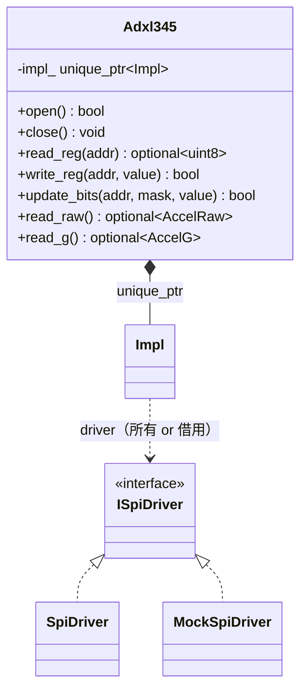

# 詳細設計書 — Adxl345

| 項目 | 内容 |
|---|---|
| ドキュメント番号 | DES-ADXL-001 |
| バージョン | 1.0 |
| 作成日 | 2026-06-01 |
| 作成者 | 開発チーム |

---

## 1. クラス概要

`Adxl345` は ADXL345（3軸 SPI 加速度センサ）への高レベルアクセスを提供する。`SpiDriver` を **PIMPL**（`struct Impl;` 前方宣言 + `unique_ptr`）で隠蔽し、`ISpiDriver` への依存注入（DI）で実機/モックを切り替える。レジスタアクセス層（`read_reg`/`write_reg`/`update_bits`）の上に加速度読み出し API を構築する。

> **位置づけ（重要）**: `libadxl345` は `libsensor`（`Sensor`=MCP3008 / `Ads1115`=ADS1115）とは**独立した別コンポーネント**である。ディレクトリ・CMake ターゲット・リリースタグ（`libadxl345/v*`）をそれぞれ独立して持ち、`libsensor` を取り除いても単体でビルド・動作する。`spi-hal`（`ISpiDriver`）だけを共有する。
> - `libsensor` … **コマンド型 ADC**（レジスタを持たず、決まったバイト列を送って読む）の例。
> - `libadxl345` … **レジスタ型デバイス**（レジスタマップをビット単位で読み書きする）の例。
> 対になる2つの設計例として読み比べると、デバイス種別ごとの抽象化の違いが分かりやすい。

## 2. クラス図



## 3. メソッド詳細

### 3.1 open() 初期化シーケンス

```
1. ISpiDriver::Config{ speed_hz=1MHz, bits_per_word=8, mode=3 } で open
2. read_device_id() → DEVID(0x00) が 0xE5 でなければ close して false
3. write_reg(DATA_FORMAT, FULL_RES | RANGE_16G)  失敗なら close して false
4. write_reg(POWER_CTL, MEASURE)                 失敗なら close して false（測定開始）
return true
```

### 3.2 read_reg() / write_reg() — アドレスバイトのフレーミング

各転送は 2 バイト。先頭の**アドレスバイト**で R/W・連続転送・アドレスを指定する（`adxl345::access`）。

| 操作 | TX | RX |
|---|---|---|
| `read_reg(addr)` | `[ READ\|addr, 0x00 ]` | `[ _, value ]` |
| `write_reg(addr, value)` | `[ WRITE\|addr, value ]` | `[ _, _ ]` |

- `READ=0x80`（bit7=1）/ `WRITE=0x00` / `MULTIBYTE=0x40`（bit6）/ `ADDR_MASK=0x3F`（bit5:0）。

### 3.3 read_raw() — マルチバイト読み出し

```
TX: [ READ | MULTIBYTE | DATAX0(0x32),  dummy x6 ]   （アドレスバイト = 0xF2）
RX: [ _, X0, X1, Y0, Y1, Z0, Z1 ]                     （各軸リトルエンディアン）
x = (int16_t)((rx[2]<<8) | rx[1])    // 以降 Y, Z も同様
```

7 バイトのフルデュプレクス転送 1 回で 3 軸（6 バイト）を取得する。

### 3.4 update_bits() — read-modify-write

```
current = read_reg(addr)            // 失敗なら false
updated = (current & ~mask) | (value & mask)
return write_reg(addr, updated)
```

## 4. 依存注入（DI）/ 所有権

`Impl` が `ISpiDriver* driver` と `bool owns_driver` を持つ。`Adxl345(path)` は内部で `SpiDriver` を `new`（`owns_driver=true`）、`Adxl345(ISpiDriver*)` は借用（`owns_driver=false`）。デストラクタは所有時のみ `delete`。テストでは `MockSpiDriver` を注入し、レジスタ R/W シーケンスを実機なしで検証する。

## 5. エラーハンドリング方針

- レジスタ層は転送失敗時に `read_reg`→`nullopt` / `write_reg`→`false`。`open()` は失敗時に close して `false`。
- 例外は使用しない（SPI ドライバの `noexcept` 設計と整合）。

## 6. スレッド安全性

スレッドセーフではない。コピー禁止。

## 7. バージョン履歴

| バージョン | 変更内容 |
|---|---|
| 1.0 | 初版 |
