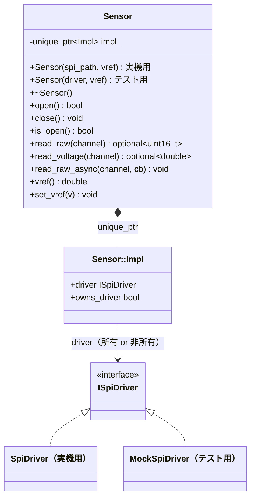
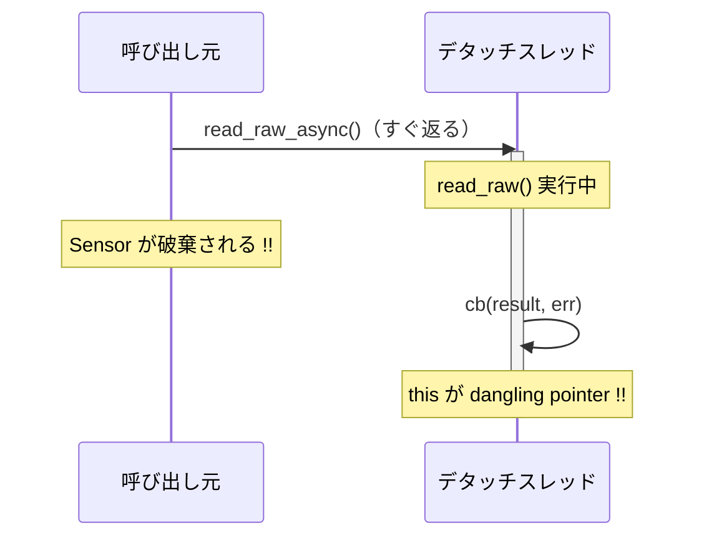
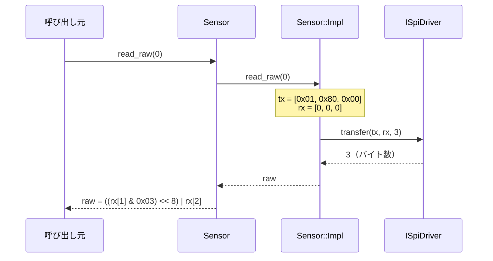

# 詳細設計書 — libsensor（Sensor / Ads1115）

> 本書は libsensor の 2 製品を扱う。§1〜§8 は `Sensor`（MCP3008 / SPI）、§9 は `Ads1115`（ADS1115 / I2C, 任意ターゲット）。

| 項目 | 内容 |
|---|---|
| ドキュメント番号 | DES-LIB-001 |
| バージョン | 1.1 |
| 作成日 | 2025-06-06 |
| 作成者 | 山田 太郎 |

---

## 1. クラス概要

`Sensor` はSPIデバイスへの**高レベルアクセス**を提供するクラスである。
内部ではPIMPLイディオムを使って実装詳細を隠蔽し、
コンストラクタ引数によって実機用・テスト用ドライバを切り替えられる設計になっている。

### 主な設計上の特徴

| 特徴 | 実現方法 |
|---|---|
| ABI安定性 | PIMPLイディオム（`Sensor::Impl` を `unique_ptr` で保持） |
| テスト可能性 | `ISpiDriver*` を外部から注入できるコンストラクタを持つ |
| 非同期対応 | `std::thread` + `detach` で `read_raw_async()` を実装 |
| コピー禁止 | ファイルディスクリプタを所有するため `= delete` で禁止 |

---

## 2. クラス図



---

## 3. PIMPLイディオム

### 3.1 設計意図

```cpp
// sensor.hpp — ヘッダには前方宣言のみ
class Sensor {
    struct Impl;                       // 前方宣言
    std::unique_ptr<Impl> impl_;       // ポインタで保持
};

// sensor.cpp — 実装の詳細はここだけ
struct Sensor::Impl {
    ISpiDriver* driver;
    bool        owns_driver;
    ...
};
```

ヘッダに `SpiDriver` のインクルードが不要になるため:

1. **再コンパイル削減**: `spi_driver.hpp` を変更しても `sensor.hpp` をインクルードしたファイルを再コンパイルしなくてよい
2. **ABI安定化**: `Impl` の内容を変えても `Sensor` のバイナリサイズが変わらない
3. **依存隠蔽**: `<linux/spi/spidev.h>` をライブラリ利用者に露出しない

### 3.2 所有権の管理

`Impl` は `driver` ポインタの所有権を `owns_driver` フラグで管理する:

```
Sensor(spi_path) → Impl が SpiDriver を new → owns_driver = true
Sensor(driver*)  → Impl はドライバを借りる  → owns_driver = false
```

デストラクタでは `owns_driver == true` の場合のみ `delete` する。
これにより、実機用・テスト用で同一の Impl 構造体を使いながら所有権を正しく管理できる。

---

## 4. 依存注入（DI）の仕組み

```cpp
// 実機用: SpiDriver を内部で生成して所有する
explicit Sensor(const std::string& spi_path)
    : impl_(std::make_unique<Impl>(spi_path))  // Impl が SpiDriver を new
{}

// テスト用: ISpiDriver* を外部から受け取る（所有しない）
explicit Sensor(ISpiDriver* driver)
    : impl_(std::make_unique<Impl>(driver))    // Impl はポインタを借用
{}
```

テストでは `MockSpiDriver` を渡すことで実機なしに動作を検証できる:

```cpp
MockSpiDriver mock;
EXPECT_CALL(mock, open(_)).WillOnce(Return(true));
// CH0 から raw=512 が返るよう rx[1]=0x02, rx[2]=0x00 を注入する
EXPECT_CALL(mock, transfer(_, _, 3)).WillOnce(DoAll(FillMcp3008Rx(512), Return(3)));

Sensor s(&mock);   // 実機不要
s.open();
auto raw = s.read_raw(0);
ASSERT_TRUE(raw.has_value());
EXPECT_EQ(*raw, 512u);
```

---

## 5. MCP3008 読み出しプロトコル実装

MCP3008 はシングルエンド／差動入力に対応した 8ch・10bit SPI ADC である。
1 回の読み出しは **3 バイトのフルデュプレクス転送**で完結する
（詳細は [SPIハードウェアIF仕様書](../05_interface-spec/spi-hardware-if.md) 参照）。

### 5.1 read_raw()

```
入力: channel（0〜7）
処理:
  1. channel が CHANNEL_COUNT(8) 以上なら nullopt を返す
  2. tx[3] を構築する:
        tx[0] = 0x01                    （スタートビット）
        tx[1] = 0x80 | (channel << 4)   （シングルエンド + チャネル選択）
        tx[2] = 0x00                    （クロック供給用ダミー）
  3. ISpiDriver::transfer(tx, rx, 3) を呼び出す
  4. raw = ((rx[1] & 0x03) << 8) | rx[2]   （下位 10bit を組み立てる）
出力: optional<uint16_t>（0〜1023）。失敗時は nullopt
```

### 5.2 read_voltage()

```
入力: channel（0〜7）
処理:
  1. raw = read_raw(channel)
  2. raw が nullopt なら nullopt を返す
  3. voltage = raw * vref() / ADC_MAX を返す
出力: optional<double>（電圧 [V]）。失敗時は nullopt
```

---

## 6. read_raw_async() のスレッド設計

### 6.1 実装

```cpp
void Sensor::read_raw_async(uint8_t channel, ReadCallback cb)
{
    std::thread([this, channel, cb]() {
        auto result = this->read_raw(channel);
        int  err    = result ? 0 : impl_->driver->last_errno();
        cb(result, err);
    }).detach();
}
```

`std::thread::detach()` によりスレッドをデタッチし、呼び出し元はブロックしない。

### 6.2 ライフタイムの注意事項

**重要**: `read_raw_async()` でデタッチしたスレッドは `Sensor` のデストラクタを待たない。



**対策**: `Sensor` オブジェクトのライフタイムをコールバック完了まで呼び出し元が保証すること。
長期稼働デーモンでは `shared_ptr + enable_shared_from_this` の採用を検討すること。

### 6.3 スレッドセーフ性

`Sensor` はスレッドセーフではない。複数スレッドから同一インスタンスに `read_raw()`/`read_voltage()` を
並行して呼び出す場合は呼び出し元でミューテックス管理を行うこと。

---

## 7. エラーハンドリング方針

| 状況 | 戻り値 |
|---|---|
| `read_raw()` 失敗（未オープン、範囲外チャネル、転送エラー）| `std::nullopt` |
| `read_voltage()` 失敗 | `std::nullopt` |
| `open()` 失敗 | `false` |
| `read_raw_async()` エラー | コールバックの第2引数（err）に errno 値を渡す |

例外は使用しない（`SpiDriver` 側の `noexcept` 設計と整合させるため）。

---

## 8. シーケンス図（同期読み出し）



---

## 9. Ads1115（I2C, 任意ターゲット）

`Ads1115` は ADS1115（4ch / 16bit I2C ADC）への高レベルアクセス。`Sensor`（MCP3008 / SPI）と対をなし、**`II2cDriver` への DI + PIMPL** という同じ設計パターンで作る。`i2c-hal` がある場合のみビルドされる独立ターゲット（`-lads1115`）。レジスタ詳細は [IF-ADS-001](../05_interface-spec/ads1115-register-map.md)。

### 9.1 クラス構成 / 依存注入

`Impl` は `II2cDriver* driver` / `bool owns_driver` / `uint16_t addr` / `Gain gain` / `bool rdy_pin_enabled` を持つ。`Ads1115(path, addr)` は `I2cDriver` を `new`（所有）、`Ads1115(II2cDriver*, addr)` は借用（テストでは `MockI2cDriver` を注入）。16bit レジスタ I/O はヘルパで行う:

| ヘルパ | 動作 |
|---|---|
| `write_reg16(reg, val)` | `[ reg, MSB, LSB ]` の 3 バイトを `driver->write()` |
| `read_reg16(reg, out)` | `driver->write_read(&reg, 1, rx, 2)`（リピーテッドスタート）|

### 9.2 read_raw() — シングルショット + OS ポーリング

```
入力: channel(0〜3)。範囲外は nullopt
1. Config を組み立てる:
   OS_SINGLE | (MUX_SINGLE | channel<<12) | pga_bits(gain) | MODE_SINGLE | DR_128SPS | comp_que
   comp_que = rdy_pin_enabled ? COMP_QUE_ONE(0x0000) : COMP_QUE_DISABLE(0x0003)
2. write_reg16(CONFIG, config)        // OS=1 で変換開始
3. 変換完了待ち: read_reg16(CONFIG) の OS(bit15)==1 まで（最大16回・500us間隔）
4. read_reg16(CONVERSION) → (int16_t)
出力: optional<int16_t>
```

### 9.3 read_voltage() / ゲイン

`read_voltage = raw * full_scale(gain) / 32768`。`set_gain` / `gain` / `full_scale_volts` で PGA（±6.144V〜±0.256V）を管理する。

### 9.4 enable_conversion_ready_pin()

`Hi_thresh(0x03)=0x8000` / `Lo_thresh(0x02)=0x0000` を書き、`rdy_pin_enabled=true` にする。以降の `read_raw` の Config は `COMP_QUE_ONE` を使い、変換完了で ALERT/RDY をアサートさせる。GPIO 割り込み（[DES-GPIO-001](gpio-design.md)）と組み合わせると、OS ポーリングの代わりに割り込み駆動で読み出せる。

### 9.5 スレッド安全性

スレッドセーフではない。`Sensor` と異なり非同期 API は持たず、割り込み駆動は `GpioLine` 側で実現する。
