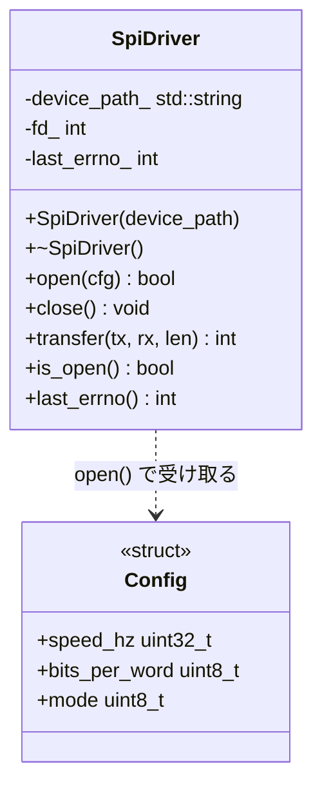
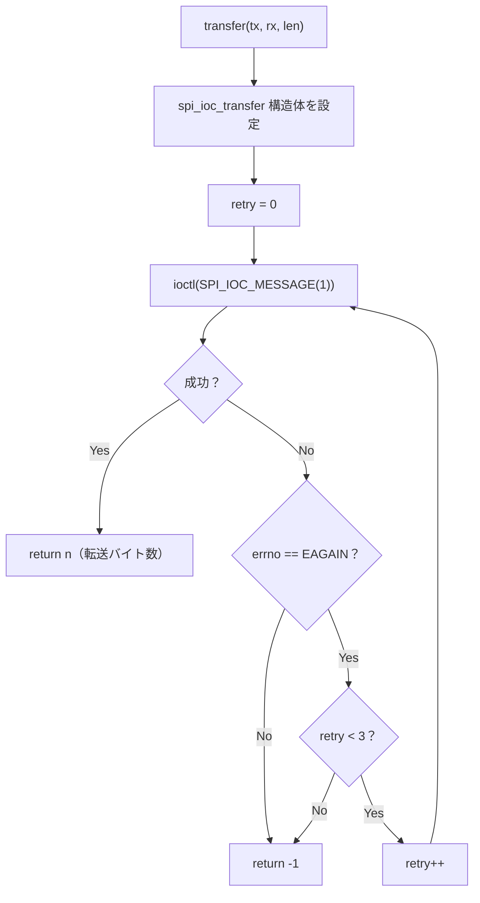

# 詳細設計書 — SpiDriver

| 項目 | 内容 |
|---|---|
| ドキュメント番号 | DES-DRV-001 |
| バージョン | 1.1 |
| 作成日 | 2025-03-07 |
| 作成者 | 山田 太郎 |

---

## 1. クラス概要

`SpiDriver` は `/dev/spidev` キャラクタデバイスを介してSPIデバイスとフルデュプレクス通信を行う。ファイルディスクリプタのライフタイムをクラスで管理し、コピー禁止とする。

## 2. クラス図



## 3. メソッド詳細

### 3.1 open()

```
入力: Config（speed_hz, bits_per_word, mode）
処理:
  1. ::open(device_path_, O_RDWR) → fd_
  2. ioctl SPI_IOC_WR_MODE
  3. ioctl SPI_IOC_WR_BITS_PER_WORD
  4. ioctl SPI_IOC_WR_MAX_SPEED_HZ
  いずれかが失敗した場合 fd_ をクローズして false を返す
出力: bool（成功/失敗）
```

### 3.2 transfer() — リトライシーケンス



## 4. エラーハンドリング方針

- エラー発生時は `last_errno_` に `errno` を保存する
- 例外は使用しない（組み込み環境を考慮）
- 呼び出し元は戻り値で成否を判断し、必要に応じて `last_errno()` を参照する

## 5. スレッド安全性

`SpiDriver` はスレッドセーフではない。複数スレッドから同一インスタンスを使用する場合は、呼び出し元でミューテックス管理を行うこと。
