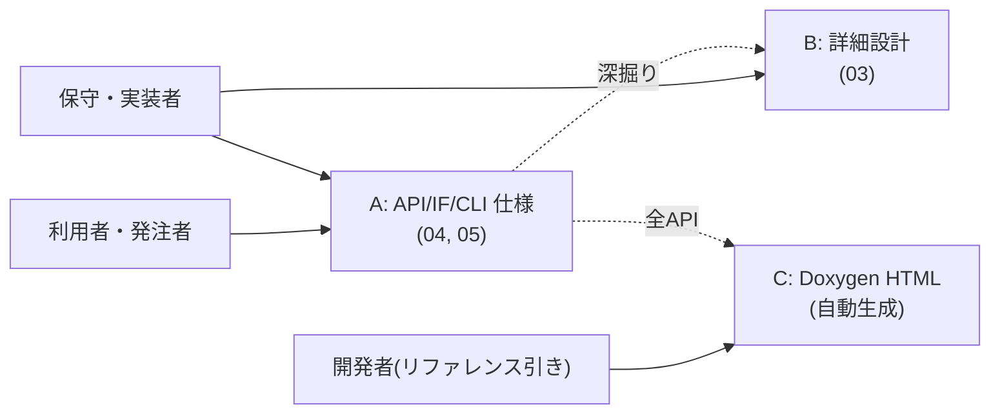

# 納品ドキュメント索引（deliverables）

このディレクトリは **発注者へ納品する案件成果物** を格納する。
学習・教育用の資料は [`docs/guides/`](../guides/learning-guide.md) にあり、**本ディレクトリとは役割が異なる**（学習資料は納品対象外）。

> はじめての人はこのページだけ読めば、「誰が・どの文書を・どこで読むか」と「PDF / Word / HTML の作り方」が分かるようにしてある。

---

## 1. 読者別の入口（層構成 A / B / C）

仕様の基本から内部詳細までを1つの文書に詰めると読みにくくなる。本案件では**読者と抽象度（altitude）で文書を分離**し、入口で振り分ける。

| 層 | 中身 | 主な読者 | 置き場所 |
|---|---|---|---|
| **A：外部仕様（浅い・読み物）** | 何ができて、どう呼ぶか、保証は何か。API仕様 / IF仕様 / CLI操作仕様 | 利用者・連携先・発注者 | [`04_api-spec/`](04_api-spec/) ・ [`05_interface-spec/`](05_interface-spec/) |
| **B：詳細設計（深い）** | 内部シーケンス・エラー処理・スレッド安全性・DI 構造 | 保守・実装者 | [`03_detailed-design/`](03_detailed-design/) |
| **C：APIリファレンス（網羅・自動生成）** | 全クラス・全シグネチャの機械生成リファレンス | 開発者（リファレンス引き） | Doxygen → `docs/doxygen/html/index.html` |

**設計方針**：A層は「契約・使い方・代表例」に絞り、**全関数の羅列はしない**（それはC層=Doxygenの仕事）。これによりA層が薄く読みやすくなり、深掘りしたい人だけがB層／C層へ進める。



---

## 2. コンポーネント別 対応表（＝ナビ兼・整備状況）

凡例： ✅ 完備　🟡 一部（要追記）　⬜ 未作成（本案件で作成）　— 対象外

| コンポーネント | 種別 | B：詳細設計 (03) | A：API/操作仕様 (04) | A：IF/レジスタ仕様 (05) |
|---|---|---|---|---|
| **spi-hal** | ドライバ | ✅ [spihal-design](03_detailed-design/spihal-design.md) | ✅ [spi-driver-api](04_api-spec/spi-driver-api.md) | ✅ [spi-hardware-if](05_interface-spec/spi-hardware-if.md) |
| **i2c-hal** | ドライバ | ✅ [i2c-hal-design](03_detailed-design/i2c-hal-design.md) | ✅ [i2c-driver-api](04_api-spec/i2c-driver-api.md) | ✅ [i2c-hardware-if](05_interface-spec/i2c-hardware-if.md) |
| **gpio** | ドライバ | ✅ [gpio-design](03_detailed-design/gpio-design.md) | ✅ [gpio-api](04_api-spec/gpio-api.md) | ✅ [gpio-line-if](05_interface-spec/gpio-line-if.md) |
| **libsensor**（MCP3008 / SPI） | ライブラリ | ✅ [libsensor-design](03_detailed-design/libsensor-design.md) | ✅ [libsensor-api](04_api-spec/libsensor-api.md) | （MCP3008 は spi-hardware-if 参照） |
| **libsensor**（ADS1115 / I2C） | ライブラリ | ✅ [libsensor-design §9](03_detailed-design/libsensor-design.md) | ✅ [ads1115-api](04_api-spec/ads1115-api.md) | ✅ [ads1115-register-map](05_interface-spec/ads1115-register-map.md) |
| **libadxl345** | ライブラリ | ✅ [libadxl345-design](03_detailed-design/libadxl345-design.md) | ✅ [adxl345-api](04_api-spec/adxl345-api.md) | ✅ [adxl345-register-map](05_interface-spec/adxl345-register-map.md) |
| **cli**（device-ctl） | CLI | ⬜ `cli-design.md`（任意） | ⬜ `cli-device-ctl-spec.md`（操作仕様） | — |
| **kernel**（オプション拡張） | C ドライバ | ✅ [kernel-driver-design](03_detailed-design/kernel-driver-design.md) | — | ⬜ `kernel-module-if.md` |
| **common**（logger） | 共通基盤 | — | ⬜ `common-logger-api.md` | — |

> **C層（Doxygen）は全コンポーネント横断で自動生成**される（`Doxyfile` の `INPUT` に各 `include/` と `cli/src`・`common/include`・`kernel/include` を登録済み）。
> ただし**ヘッダの Doxygen コメントが不足している箇所はリファレンスが空になる**ため、各コンポーネント整備時に併せて補充する（既知の不足例：`common/include/logger.hpp`, `spi-hal/include/logger.hpp` がコメント0）。

### 工程横断の文書（コンポーネントに依らない）

| 文書 | 場所 |
|---|---|
| 要件定義書 | [01_requirements/requirements-spec.md](01_requirements/requirements-spec.md) |
| 基本設計（システム構成） | [02_basic-design/system-architecture.md](02_basic-design/system-architecture.md) |
| テスト計画 | [06_test/test-plan.md](06_test/test-plan.md) |
| リリースノート | [07_delivery/release-notes/](07_delivery/release-notes/) |

---

## 3. ディレクトリ構成（工程別 / V字モデル準拠）

既存の工程別ナンバリングを**維持**する（コンポーネント別の見方は本索引の §2 で代替）。

```
docs/deliverables/
├── README.md                 ← この索引（入口）
├── _templates/               ← 新規文書のひな形（変換対象外）
├── 00_project/               ← 議事録など案件管理
├── 01_requirements/          ← 要件定義
├── 02_basic-design/          ← 基本設計（システム構成）
├── 03_detailed-design/       ← B層：詳細設計
├── 04_api-spec/              ← A層：API仕様 / CLI操作仕様
├── 05_interface-spec/        ← A層：ハード/バス/レジスタ IF 仕様
├── 06_test/                  ← テスト計画
└── 07_delivery/              ← リリースノート等
```

---

## 4. 文書番号の規約

`<種別>-<コンポーネント略号>-<連番>` 形式（例：`API-DRV-001`, `IF-SPI-001`, `DES-LIB-001`）。

| 種別 | 接頭辞 | 略号例 |
|---|---|---|
| 要件定義 | `REQ` | — |
| 基本/詳細設計 | `DES` | `DRV`(spi) / `I2C` / `GPIO` / `LIB`(sensor) / `ADXL` / `CLI` / `KRN` |
| API仕様 | `API` | 同上 + `ADS`(ads1115) / `COM`(common) |
| CLI操作仕様 | `OPS` | `CLI` |
| IF/レジスタ仕様 | `IF` | `SPI` / `I2C` / `GPIO` / `ADS` / `ADXL` / `KRN` |

---

## 5. 配布物（PDF / Word / HTML）の作り方

Markdown を唯一のソースとし、配布物は機械生成する（スクリプト本体: [`tools/build-docs.sh`](../../tools/build-docs.sh)）。

```sh
# PDF + Word + HTML(Doxygen) を一括生成（pandoc / doxygen / xelatex が必要）
bash tools/build-docs.sh

# 個別に生成したい場合
bash tools/build-docs.sh pdf
bash tools/build-docs.sh docx
bash tools/build-docs.sh html
```

| 配布物 | 生成元 | 出力先 |
|---|---|---|
| PDF | pandoc + xelatex（CJK: Noto Serif CJK JP） | `output/pdf/` |
| Word (.docx) | pandoc + `tools/docs-reference.docx` | `output/docx/` |
| HTML（APIリファレンス） | Doxygen | `docs/doxygen/html/` |

> 生成物（`output/`・`docs/doxygen/html/`）は `.gitignore` 済み。リポジトリには **Markdown ソースのみ** を置く。

### 5.1 生成に必要なツール

| ツール | 用途 | 無い場合 |
|---|---|---|
| `pandoc` | Markdown → PDF / Word | 該当ステップをスキップ |
| `xelatex`（TeX Live）+ Noto Serif CJK JP | PDF の日本語組版 | PDF をスキップ |
| `doxygen`（+ `graphviz` の `dot`） | APIリファレンス HTML | HTML をスキップ／図を省略 |
| `mermaid-filter`（任意, npm） | PDF/Word 内の mermaid 図を画像化 | mermaid はコードのまま出力 |

ローカルに揃えない場合は `Dockerfile.build` のイメージ内で実行する（CI と同じ経路）: `./docker-build.sh`。

### 5.2 Word の体裁（reference.docx）

`tools/docs-reference.docx` が**あれば**その体裁（見出し・フォント・余白）が Word 出力に反映される。**無ければ**スクリプトが pandoc 既定テンプレートを自動生成して使う。自社体裁に合わせる場合：

```sh
# 1. 編集可能な雛形を書き出す
pandoc --print-default-data-file reference.docx > tools/docs-reference.docx
# 2. Word/LibreOffice で開きスタイル（見出し1〜3・本文・表・余白）を調整して上書き保存
# 3. 必要に応じてコミットする（バイナリだが体裁の共有資産として管理してよい）
```

> `mainfont` 等のフォント指定（`tools/docs-metadata.yaml`）は **PDF(xelatex) 専用**で Word には効かない。Word のフォントは reference.docx の各スタイルで指定する。
