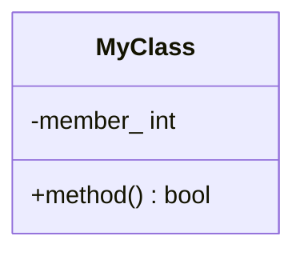

<!--
  詳細設計書テンプレート（B層 / 保守・実装者向け）
  使い方:
    1. このファイルを 03_detailed-design/<component>-design.md にコピーする
    2. 〈...〉のプレースホルダを埋め、不要な節は削除する
    3. 利用者向けの仕様は API/IF 仕様(A層) に書き、ここでは重複させない
  ※ _templates/ 配下は build-docs.sh の変換対象外（PDF/Word化されない）
-->
# 詳細設計書 — 〈コンポーネント名〉

| 項目 | 内容 |
|---|---|
| ドキュメント番号 | DES-〈略号〉-001 |
| バージョン | 0.1 |
| 作成日 | YYYY-MM-DD |
| 作成者 | 〈氏名 / チーム〉 |

---

## 1. クラス / モジュール概要

〈責務・ライフタイム・所有権・コピー/ムーブ可否・エラー方針（例外不使用 等）を要約〉

## 2. クラス図 / 構成



## 3. メソッド / 処理詳細

### 3.1 〈method〉()

```
入力: 〈引数〉
処理:
  1. 〈ステップ〉
出力: 〈戻り値〉
```

〈必要に応じて mermaid flowchart / sequenceDiagram を添える〉

## 4. エラーハンドリング方針

- 〈errno 保存・戻り値判定・例外不使用 など〉

## 5. スレッド安全性

- 〈スレッドセーフか／呼び出し側でのロック要否〉

## 6. 依存関係 / 注入点（DI）

- 〈依存する純粋仮想インターフェース（ISpiDriver 等）とモック注入点〉

## 7. バージョン履歴

| バージョン | 変更内容 |
|---|---|
| 0.1 | 初版（ドラフト） |
