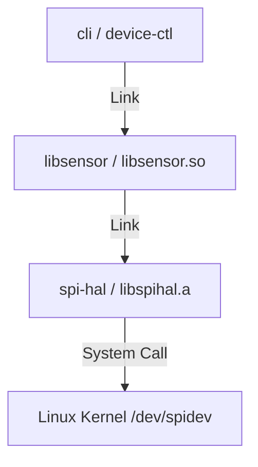
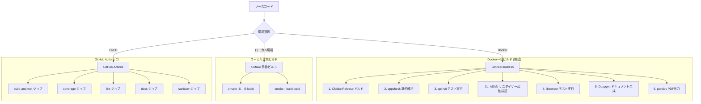

# ビルドガイド (Build Guide)

本リポジトリ (`embedded-device-suite`) のビルドシステム、ビルド手順、テスト実行方法、およびビルド結果の検証方法について説明します。

---

## 1. ビルドアーキテクチャの概要

本プロジェクトは複数のサブコンポーネントから構成されるモノレポ構成を取っており、CMake をメタビルドシステムとして採用しています。

### コンポーネント依存関係



### 主要ビルドターゲット
| コンポーネント | ビルド生成物 | 説明 |
|---|---|---|
| `spi-hal` | `build/spi-hal/libspihal.a` | Linux SPI 通信を行う静的ライブラリ |
| `libsensor` | `build/libsensor/libsensor.so` | MCP3008 等のセンサー値処理を行う共有ライブラリ |
| `cli` | `build/cli/device-ctl` | 対話モードを提供するコマンドラインツール |

---

## 2. ビルド方法の選択肢

開発者は以下の 3 つの方法でビルドと検証を実行できます。



---

## 3. Docker 一括ビルド（推奨）

ホスト OS にツールチェーン（g++, CMake, Doxygen, pandoc, LaTeX 等）をインストールすることなく、再現性のあるビルド環境で一括テストおよび成果物生成を行います。

### 実行方法
```bash
./docker-build.sh
```

> [!NOTE]
> ホスト側で Docker 成果物の所有者が `root` に変わるのを防ぎたい場合は、必要に応じて `docker run` の引数に `--user $(id -u):$(id -g)` を追加して実行してください。

### 実行されるパイプライン（`docker-entrypoint.sh`）
1. **CMakeビルド (Release)**: リリースビルドの生成
2. **cppcheck 静的解析**: `warning,performance,portability` カテゴリの検証
3. **単体テスト: spi-hal**: Debugビルドを行い、Google Test にて単体テストを実行（結果は JUnit XML 形式で保存）
4. **サニタイザービルド (ASAN + UBSAN)**: AddressSanitizer と UndefinedBehaviorSanitizer を有効化して CLI の動作確認
5. **単体テスト: libsensor**: モックドライバを用いて単体テストを実行
6. **Doxygen生成**: ソースコードの API 仕様書を HTML 生成
7. **pandoc PDF出力**: 設計書や要件定義書などの Markdown を PDF 形式に一括変換

### 出力先
* **バイナリ**: `build/cli/device-ctl`, `build/libsensor/libsensor.so`
* **テスト結果**: `test-results/` (`spihal-unit.xml`, `libsensor-unit.xml`)
* **API ドキュメント**: `docs/doxygen/html/index.html`
* **設計書 PDF**: `output/pdf/`

---

## 4. ローカル環境ビルド

ホスト環境にツールチェーンが導入されている場合、手動で CMake を叩いて開発ビルドを行います。

### 基本ビルド手順

Release / Debug ビルドの基本コマンドは [README — クイックスタート](../../../README.md#クイックスタート) を参照してください。

以下では、README には含まれない **詳細な手順** を説明します。

### 単体テストの実行手順
各サブコンポーネントを個別に Debug ビルドしてインストールし、テストランナーを起動します。

```bash
# 1. spi-hal テスト実行
cmake -S spi-hal -B build/spihal-debug -DCMAKE_BUILD_TYPE=Debug
cmake --build build/spihal-debug
cmake --install build/spihal-debug --prefix /usr/local
cmake -S tests/unit/spi-hal -B build/test-spihal -DCMAKE_BUILD_TYPE=Debug -DCMAKE_CXX_FLAGS="-I$(pwd)/spi-hal/include"
cmake --build build/test-spihal
./build/test-spihal/test_spi_driver

# 2. libsensor テスト実行
cmake -S libsensor -B build/libsensor-debug -DCMAKE_BUILD_TYPE=Debug
cmake --build build/libsensor-debug
cmake --install build/libsensor-debug --prefix /usr/local
cmake -S tests/unit/libsensor -B build/test-libsensor -DCMAKE_BUILD_TYPE=Debug -DCMAKE_CXX_FLAGS="-I$(pwd)/libsensor/include -I$(pwd)/tests/mocks"
cmake --build build/test-libsensor
./build/test-libsensor/test_sensor
```

### サニタイザービルドの手順
AddressSanitizer (ASAN) または ThreadSanitizer (TSAN) を有効化します。

> [!WARNING]
> ASAN と TSAN は排他制御のため、同時に使用することはできません。必ず個別のビルドディレクトリを作成して実行してください。

```bash
# AddressSanitizer (ASAN + UBSan)
cmake -S . -B build-asan -DCMAKE_BUILD_TYPE=Debug -DENABLE_SANITIZERS=asan
cmake --build build-asan

# ThreadSanitizer (TSAN)
cmake -S . -B build-tsan -DCMAKE_BUILD_TYPE=Debug -DENABLE_SANITIZERS=tsan
cmake --build build-tsan
```

---

## 5. CI/CD パイプライン (GitHub Actions)

`.github/workflows/ci.yml` にて定義されており、リポジトリへの Push または Pull Request 作成時に自動実行されます。ローカルの Docker ビルドとは異なり、GitHub 側の Ubuntu Runner を高速化・並列化するために Docker を使わずネイティブ実行しています。

### 定義されているジョブ一覧
* **`build-and-test`**: Release ビルドおよび `spi-hal` と `libsensor` のユニットテスト・結合テスト実行
* **`coverage`**: `--coverage` フラグ付きでビルド・テストを実行し、`gcovr` で HTML/XML カバレッジレポートを出力
* **`lint`**: `cppcheck` と `clang-tidy`（warnings-as-errors を有効化）を実行
* **`docs`**: `Doxygen` を用いて HTML API 仕様書をビルドし保存
* **`sanitizer`**: `ASAN+UBSAN` ジョブと `TSAN` ジョブを並列に動かし、データ競合やメモリ破壊が無いかを自動検査
* **`commit-lint`**: コミットメッセージおよび PR タイトルが Conventional Commits 規約に準拠しているかをチェック

