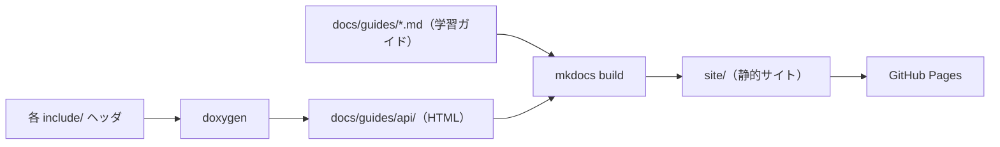

# ドキュメントサイト構築ガイド（MkDocs Material + GitHub Pages）

| 項目 | 内容 |
|---|---|
| 取り上げる対象 | `mkdocs.yml`、`tools/mkdocs-requirements.txt`、`tools/mkdocs_hooks.py`、`.github/workflows/pages.yml` |
| 目的 | `docs/guides/` の学習ガイドを、Markdown に不慣れでも読みやすい静的サイトにして公開する |
| 対象範囲 | **学習ガイド（`docs/guides/`）のみ**。案件成果物（`docs/deliverables/`）・`wiki`・`adr` は対象外（GitHub / PDF のまま） |
| 公開先 | GitHub Pages（`main` への push で自動デプロイ） |

`docs/guides/` の Markdown は GitHub 上でも読めるが、ファイルツリーを辿る必要があり、検索やナビゲーションも弱い。
そこで **MkDocs Material** でサイト化し、サイドナビ・全文検索・ダークモード・mermaid 描画を備えた
学習ガイドサイトとして公開する。Doxygen の API リファレンスも同じサイトに同梱する。

> **なぜガイドだけ？** `docs/deliverables/` は「発注者へ納品する案件成果物」のサンプルで、学習用の読み物とは
> 役割が異なり、PDF/Word 配布の経路（`tools/build-docs.sh`）も別にある。サイトは学習ガイドに特化させている。

## 全体の流れ



- 学習ガイド（`docs/guides/*.md`）→ MkDocs がサイト本体を生成。
- API リファレンス（各 `include/` ヘッダ）→ Doxygen が `docs/guides/api/` に HTML を生成し、サイトに同梱。
- 生成物（`site/`・`docs/guides/api/`）は `.gitignore` 済み。コミットせず CI で都度生成する。

## ローカルでプレビューする

```bash
# 依存を入れる（バージョン固定）
pip install -r tools/mkdocs-requirements.txt

# ライブリロード付きでプレビュー（http://127.0.0.1:8000/）
mkdocs serve

# 静的サイトを site/ に出力（CI と同じ）
mkdocs build
```

!!! note "ローカルでは API リファレンスが空になる"
    Doxygen をローカルに入れていない場合、`docs/guides/api/` が無いためナビの
    「API リファレンス (Doxygen)」だけリンク切れになる（警告が出る）。サイト本体の確認には支障ない。
    API も含めて確認したい場合は `doxygen Doxyfile` 等で生成してから `mkdocs build` する。

## ナビゲーションの仕組み（手で並べない）

ナビは [`awesome-pages` プラグイン](https://github.com/lukasgeiter/mkdocs-awesome-pages-plugin)で自動生成する。
**ページを追加すれば自動でナビに載る**ため、`mkdocs.yml` に巨大なナビ定義を手で維持しない
（CLAUDE.md の「手動メンテは罠」方針に合わせている）。

並び順とセクション名だけ、各ディレクトリの `.pages` ファイルで調整する。

```yaml
# 例: docs/guides/tooling/.pages
title: ツール別ガイド
```

```yaml
# 例: docs/guides/.pages（サイトのルートナビ。並び順を指定し、残りは "..." で自動補完）
nav:
  - index.md
  - learning-guide.md
  - ...
```

- 新しい Markdown を `docs/guides/` 配下に置くだけでサイトに追加される。
- 章タイトルや順序を整えたいときだけ、`docs/guides/.pages`（ルート）やサブディレクトリに `.pages` を置く。

## mermaid 図

`mkdocs.yml` の `pymdownx.superfences` に mermaid 用の custom fence を登録してあるため、
既存の ```` ```mermaid ```` ブロックはそのまま描画される（Material が mermaid.js を読み込む）。

> GitHub と同じく描画はクライアント側なので、**構文エラーはサイトを開くまで気づけない**。
> 構文チェックは従来どおり `tools/check-mermaid.sh`（CI の `docs` ジョブ）で機械的に弾く。

## ソースコードへのリンク自動変換

学習ガイドは `../../spi-hal/include/ispi_driver.hpp`（ソースコード）や `../deliverables/...`（案件成果物）の
ように **`docs/guides/` の外**へリンクしている。これは GitHub のファイルビューでは解決できるが、サイトには
`docs/guides/` 配下しか含まれないためリンク切れになる。

そこで build フック [`tools/mkdocs_hooks.py`](https://github.com/asiball/private-test-cpp-project/blob/main/tools/mkdocs_hooks.py) が、
**`docs/guides/` の外へ出る相対リンクだけ**を GitHub の URL（`blob/main/...`）へ自動変換する。
Markdown 本体は書き換えないので、GitHub 上ではリンクは相対のまま、サイト上では絶対 URL に解決される。
（対象範囲を変えるときはフック先頭の `_SITE_ROOT` を合わせる）

## デプロイ（GitHub Pages）

`.github/workflows/pages.yml` が `main` への push（および手動実行）で動く。

1. MkDocs の依存を入れて `mkdocs build`。
2. Doxygen を `docs/guides/api/` に生成してサイトへ同梱。
3. `actions/configure-pages`（`enablement: true`）で Pages を有効化。
4. `actions/upload-pages-artifact` → `actions/deploy-pages` で公開。

初回は **Settings → Pages → Source = GitHub Actions** になっていることを確認する
（`enablement: true` により自動で設定されるが、組織のポリシーによっては手動が要る場合がある）。

!!! warning "このリポジトリは private — サイトは公開される"
    GitHub Pages は（Free プランでは）リポジトリが private でも**サイトは一般公開**される。
    非公開のままにしたい場合は Pages を使わず、ローカルの `mkdocs serve` で閲覧する運用にすること。

## 新しいページ・コンポーネントを足したら

- 学習ガイドを追加 → `docs/guides/` 配下に置くだけで自動的にサイトに載る。順序を整えたいなら `.pages`。
- 案件成果物（`docs/deliverables/`）はサイト対象外。ガイドから張ったリンクは `tools/mkdocs_hooks.py` が
  GitHub の URL へ変換する（成果物自体は GitHub / PDF で配布）。
- 新コンポーネントを追加 → API リファレンスに含めるため `Doxyfile` の `INPUT` にヘッダディレクトリを足す
  （CLAUDE.md の「新コンポーネント追加チェックリスト」を参照）。
